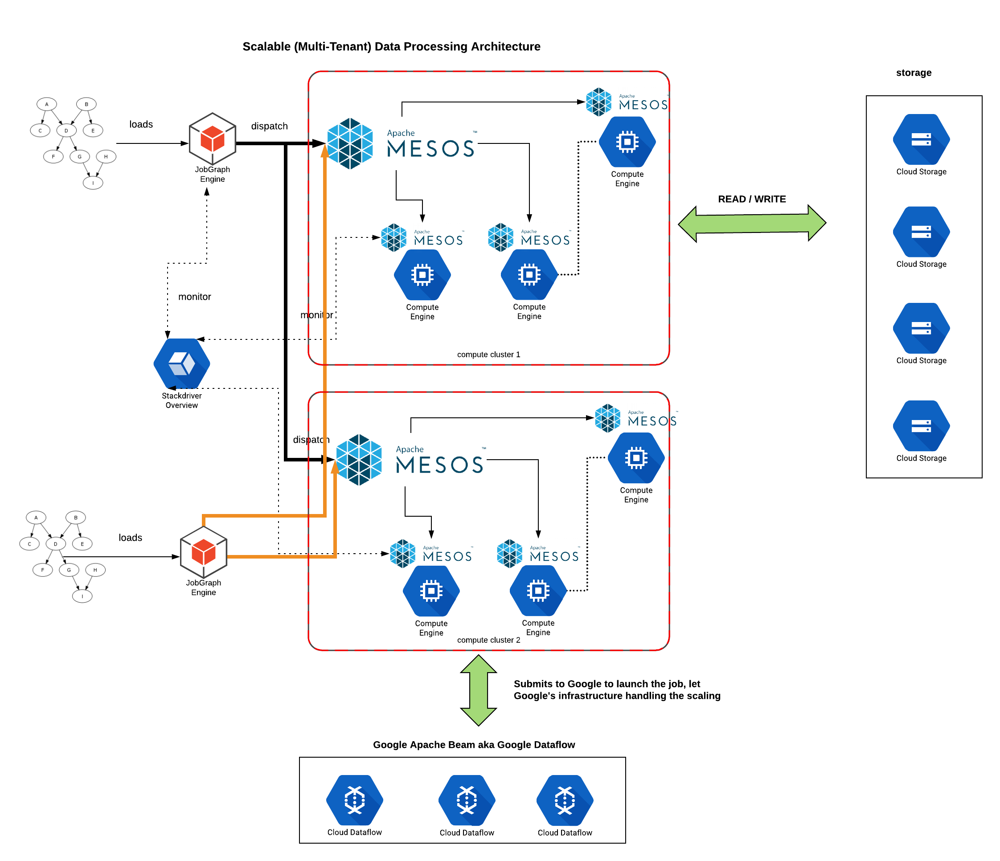
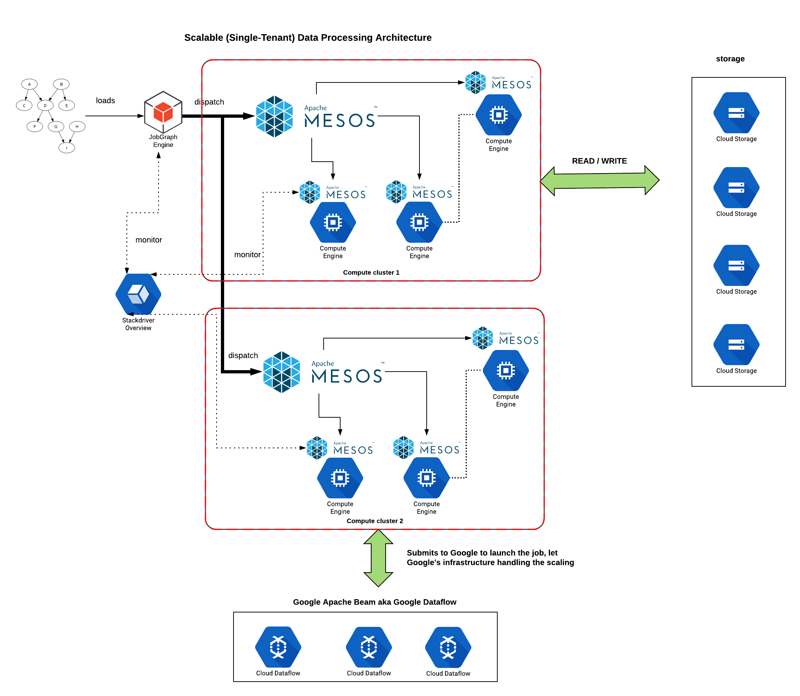

# jobgraph

# What it does

This is an engine that allows you to do two things:
- Define `job`(s) in the system and create `workflow`(s) using that and submits
  it to a Apache Beam framework for execution
- To do all that, you have to write jobs using Apache Beam's programming model
- Craft a processing graph which details your execution dependency and submit
  that to `jobgraph` and it takes care of executing the job for
  you;automatically monitors the job and starts the next dependencies once it
  has completed.

In the architecture you are about to see, it is designed to have the
flexibility to run Apache Beam jobs either in :

* (a) Same host as `JobGraph` i.e. _local-mode_ (*Note:* Not recommended)
* (b) Delegate to Google Dataflow infrastructure
* (c) Delegate to any of the nodes available in the compute cluster

Option (b) is favored over Option (c) when you have a huge job that would be
executed in Google's infrastructure (for example: you have a sizable monetary
budget); otherwise you can exercise Option(c) by switching the type of runners.

To enable Option(b), which is the default, you have to do the following:
- Make sure at least one (i.e. 1) Apache Mesos cluster is alive and configure
  it in the `application.conf`.
- `MesosDataflow:java` and `--runner=DataflowRunner` for Java jobs
- `MesosDataflow:python` and `--runner DataflowRunner` for Python jobs

To enable Option(c), which is not the default, you have to do the following:
- `Dataflow:java` and `--runner=DirectRunner` for Java jobs
- `Dataflow:python` and `--runner DirectRunner` for Python jobs

# Architecture
## Multi-tenant shared-compute Architecture
What you see here is, potentially but fictitiously, 2 customers having their
own jobs and workflows loaded and having their workload launched against any of
the nodes in the 2 (shown) compute clusters (powered by Apache Mesos);
asynchronously and concurrent.

*Note:* Neither of the tenants (i.e. customers) know the existent of the other
and they shouldn't know. This allows us, Nugit, to be grow/shrink/utilize all
compute capacity of the computational power with a workload that is distributed throughout.

A secondary advantage is to accelerate Machine Learning frameworks like Apache
Spark, Google TensorFlow to deliver faster business results to the customers.

## Single-tenant shared-compute Architecture

What you see here is a proof-of-concept where a single customer's workflows
will run asynchronously (concurrently as well) and simultaneously across 2 compute clusters (thereby
spreading the work load).

## Sandbox in the Google Cloud

## What do i need to know about JobGraph

Basic idea is to provide a mechanism that allows the user to define:
- What a _step_ (aka Job) is
  - That usually means a format has to be defined
  - A step is, for now, a `Apache Beam` job (i.e. runnable) and `jobgraph` is responsible for starting the job.
- How to describe a _workflow_ by stringing 1 or more _steps_ 
  - A configuration file (e.g. see [[workflows.conf]]) would describe how the computation would proceeed by definining a _job graph_. Take note that the steps defined in _ANY_ workflow must already exist in the system.
- The _job graph_ defines the node(s) where the system will wait. In other
  words, the system is designed to be asynchronous by default unless otherwise.
- A few common operations to be provided 

## What's a Job

A _step_ is essentially a computer program that will be executed, given a group
of parameters (e.g. inputs, outputs) and executes under the context of a
requester (e.g. `user-id`, `oauth`) on its behest.

A step is defined by the following (non-exhaustively):
- Name
- Description
- Inputs (perhaps type of inputs)
- Working Directory (this is some storage that is made available e.g. S3, GCP, multi-tiered storage systems like Alluxio)
- Session Identifier (this is a unique identifier in the entire system which identifies it)
- Runner (describes how to get the program executed e.g. `Apache Beam`)
- Run-As (the identity of the requester)

## What's a Workflow

A _workflow_ is essentially a graph of computations (i.e. graph of _steps_) to
be carried out.

A workflow is defined by the following (non-exhaustively):
- Name
- Id
- Description
- Steps (a list of names which point to the steps currently in the system)
- Job graph (a mechanism to describe how to execute the string of actions)

## What can we do with JobGraph

If you are the developer of `JobGraph` engine, you perform the following
programmtically or via ReST calls.

If you are the user of `JobGraph`, you can perform the following only via ReST
calls.

In either case, please refer to the confluence page [here](https://nugitco.atlassian.net/wiki/spaces/ND/pages/525303812/JobGraph+ReST+Interfaces)
for more details.

- Create a workflow
- Start a workflow
- Query a workflow (aka _monitoring workflow_)
- List all workflows
- Stop a workflow
- Update a workflow
- Create a job
- List all job(s)
- Monitor a Job (job ∈ Workflow)

## Limitations of JobGraph

- The workflows and jobs configuration does not survive a reboot
- If your job is not a Apache Beam job, then `JobGraph` cannot automatically
  monitor and manage the lifecycle of your workflow for you.
- Workflows cannot be restarted
- Workflows cannot be scheduled
- ~~Job parameters cannot be altered after you have created it; you need to
  create another job~~
  - Work completed in [HCD-63](https://nugitco.atlassian.net/browse/HCD-63)
- 

We will be plugging these soon.

# References
- See the `install_postgresql.md` on instructions to install postgresql database version 9.6
